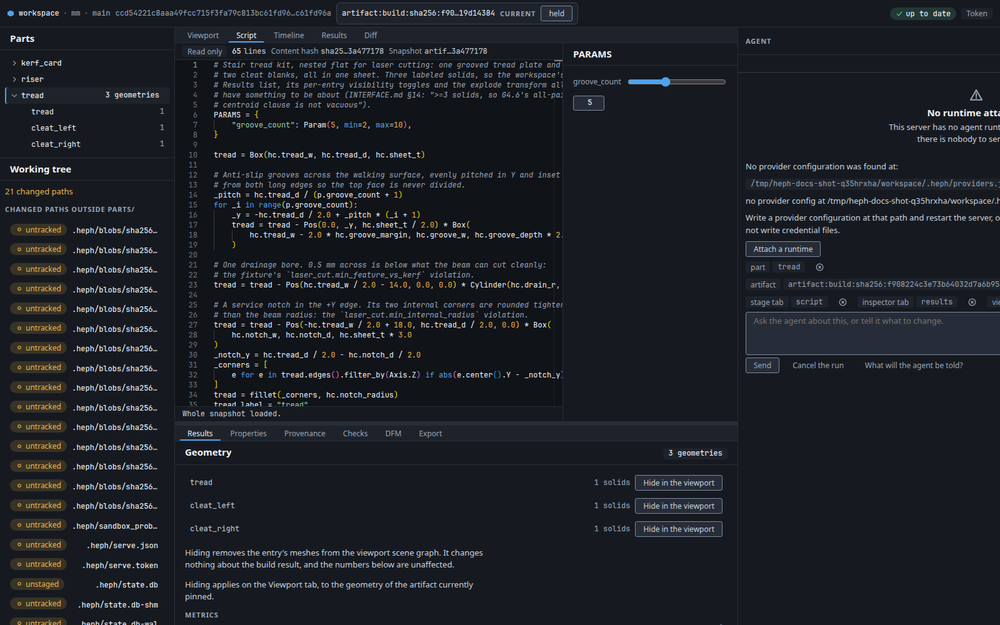

<!--
Copyright 2026 The Hephaestus Authors
SPDX-License-Identifier: Apache-2.0
-->

# Hephaestus

Hephaestus is open-source parametric CAD. You write
[build123d](https://github.com/gumyr/build123d) parts; `heph` builds, checks,
and renders them. The web UI is optional operator chrome. An Autonome Research
project, licensed Apache-2.0.



The operator UI (`heph serve --web`) on the public workspace fixture. No agent
runtime is attached; agents drive this project through the CLI.

## Install

Not on PyPI. There is no GitHub Release.

```console
$ git clone https://github.com/autonome-research/hephaestus && cd hephaestus
$ uv sync --dev
$ uv run heph --version
```

What each capability actually needs (sandbox, macOS, agent sidecar):
[docs/install.md](docs/install.md).

## Operator UI

Optional. Build the client from this clone, then run `heph serve --web` inside
a project.

```console
$ pnpm --dir web install --frozen-lockfile
$ pnpm --dir web build
$ uv run heph serve --web
```

## Headless / agents

Coding agents use `heph` from a clone. You do not need the browser or MCP.

After `uv sync --dev`, put the clone's `.venv/bin` on `PATH` (or call that
`heph` by path):

```console
$ heph init /tmp/gadget && cd /tmp/gadget
$ heph build example
$ heph lint parts/example.py
$ heph check --json
$ heph render example
```

`heph init` writes a small project that builds with nothing edited. Full verb
list: [docs/cli.md](docs/cli.md). MCP is optional: [docs/mcp.md](docs/mcp.md).

## More

- [docs/install.md](docs/install.md) — capability caveats
- [docs/cli.md](docs/cli.md) — every `heph` verb
- [docs/mcp.md](docs/mcp.md) — optional MCP client setup
- [docs/conventions.md](docs/conventions.md) — project layout and part scripts
- [CONTRIBUTING.md](CONTRIBUTING.md) — checks, headers, clean-room boundary
